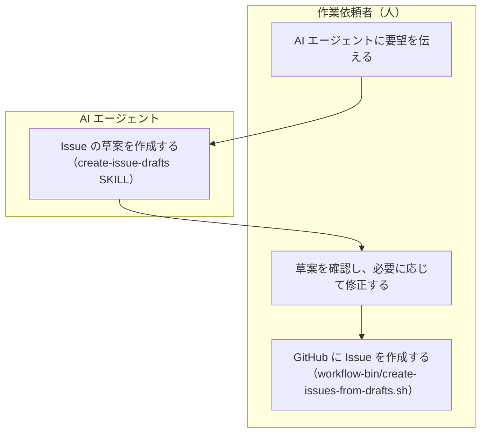
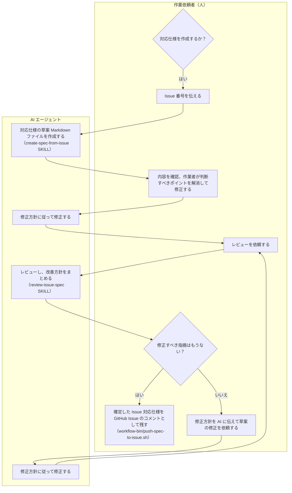
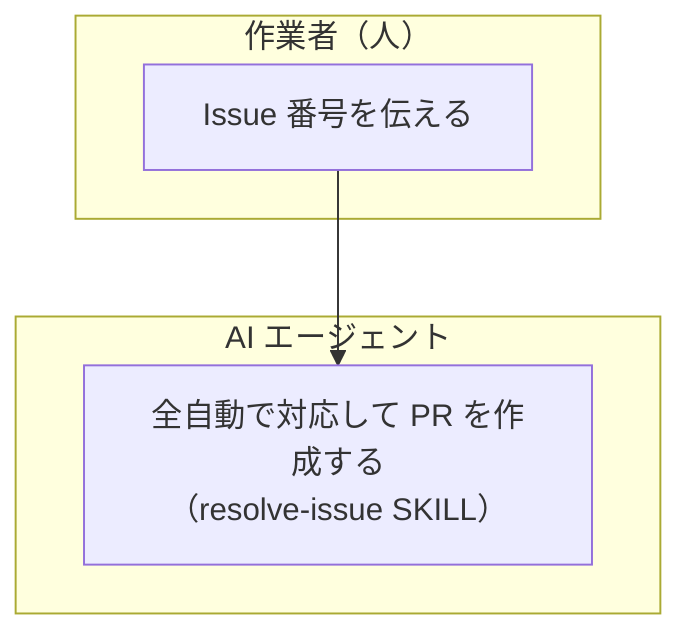

# ワークフロー

## 担当者の責務分担

担当者の責務は以下の３つに分けます。

1. 作業依頼者（人間） = 作業タスク Issue を作成する
1. 作業者（AI エージェント含む） = 作業タスクを実施して PR を作成する
1. 責任者（人間） = PR マージ判断を行う

## Issue の種類

Issue は以下の２つに分けます。

1. 作業タスクを作成するための Issue (Type: Task)
2. バグ報告などの問題や課題、提案を報告するための Issue (Type: Bug, Feature)

2 に対して対処する際には、作業依頼者が 1 の作業タスクとしての Issue を作成します。
作業者が対応するのは、1 の作業タスクとしての Issue です。

## 途中作成したドキュメントの扱い

基本的な考え方は「テストを含むソースコードが仕様」です。仕様書を更新しながらメンテナンスするということはしません。

このワークフローでは途中で以下のようなドキュメントを作成しますが、これらは作業が完了したら削除し、リポジトリには残しません。

- Issue に対してどう対応するかの仕様をまとめたドキュメント
- 仕様に基づいてどのように実装をするかの全体実施計画をまとめたドキュメント
- 複数フェーズに分かれる場合は、各フェーズの詳細実施計画をまとめたドキュメント

ワークフローを実施するために作成する上記のような途中生成物としてのドキュメントは、担当者が誰かによって Issue または PR のコメントとして残します。

- 作業依頼者が仕様を策定する場合は Issue のコメントに残す
- 作業者が仕様を策定する場合は PR のコメントに残す
- 作業者が作成する全体実施計画や各フェーズの詳細実施計画は PR のコメントに残す

このようにすることで、リポジトリにメンテナンスの必要なドキュメントとして残さず、作業依頼者または作業者の履歴としては情報を残すことができます。

## 作業依頼者のワークフロー

### Issue を作成する

1. 作業依頼者が AI エージェントに要望を伝え、AI エージェントが必要であれば複数 Issue に分割して草案 Markdown ファイルを作る
    - create-issue-drafts SKILL を利用
1. 作業依頼者が必要に応じて草案を修正する
    - AI と相談したり、修正を AI に依頼してもよい
1. 作業依頼者が修正した内容で GitHub Issue を作成する。作成し終えた Issue の Markdown ファイルは削除される。
    - workflow-bin/create-issues-from-drafts.sh を呼び出す

### Issue を元に対応仕様を作成する（オプション）

必要な場合のみ、以下の流れで対応仕様を作成します。AI エージェントが草案を作成・修正し、作業依頼者が確認した後に、AI エージェントがレビューして改善方針をまとめます。必要に応じてこの流れを繰り返します。作成しない場合は PR 作成時のワークフローへ進みます。

1. 作業依頼者が Issue 番号を伝え、AI エージェントに対応仕様の草案 Markdown ファイルを作成させる
    - create-spec-from-issue SKILL を利用
      - 内部でレビューを行い、人間の判断が必要ない修正は自動で行われる
      - 草案の最後には **作業依頼者が判断すべきポイント** を提示する
1. 作業依頼者が草案を確認して、必要に応じて修正する
    - **作業依頼者が判断すべきポイント** は全て解消しておく（AI と相談しつつ）
    - 修正方針を AI エージェントに指示して、修正させる
1. AI エージェントに草案をレビューさせ、改善方針をまとめさせ、必要に応じて修正させる
    - review-issue-spec SKILL を利用
    - 修正方針を AI エージェントに指示して、修正させる
    - 何回かレビューと指摘修正を繰り返す
1. 作業依頼者が確定した Issue 対応仕様を GitHub Issue のコメントとして残し、草案 Markdown ファイルは削除する
    - workflow-bin/push-spec-to-issue.sh を呼び出す

## 作業者のワークフロー（AI エージェント委任）

resolve-issue SKILL を利用して、Issue 番号を指定して PR を作成します。

### AI エージェントの起動も自動化したい場合

以下のような仕組みで、自動で処理を開始するような仕組みを用意することも考えられます。

- GitHub Issue に何らかのトリガーを用意する
  - コメントに特定のキーワードを入れる
  - 特定のラベルを付与する
- 上記のトリガーを検知して AI エージェントに resolve-issue SKILL を呼び出させる仕組みを用意
  - GitHub Actions で上記のトリガーを検知して、resolve-issue SKILL を呼び出す
  - PC 上で常駐させたポーリングプログラムが上記のトリガーを検知して、AI エージェントに resolve-issue SKILL を呼び出させる
