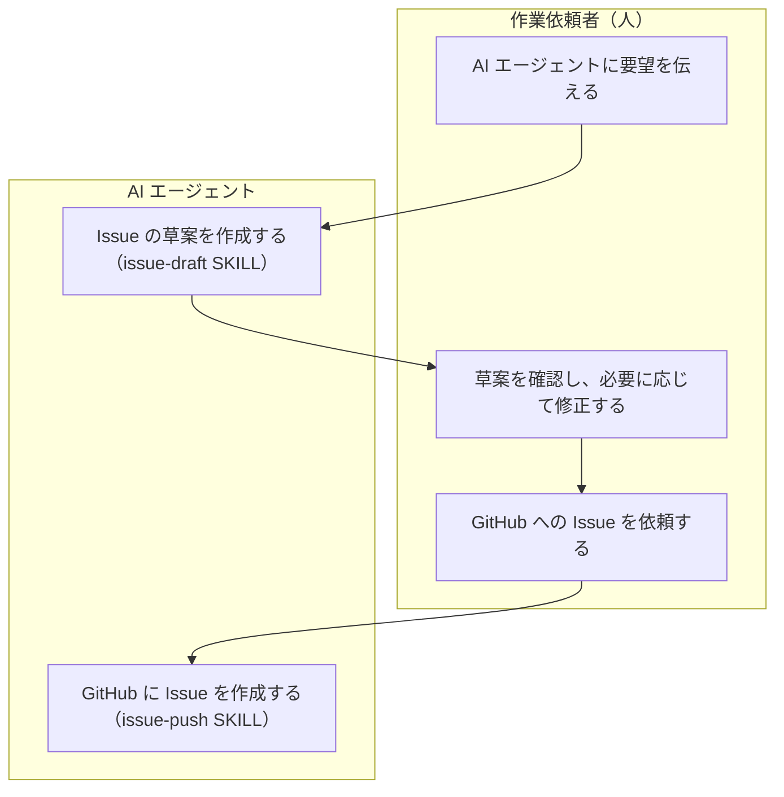
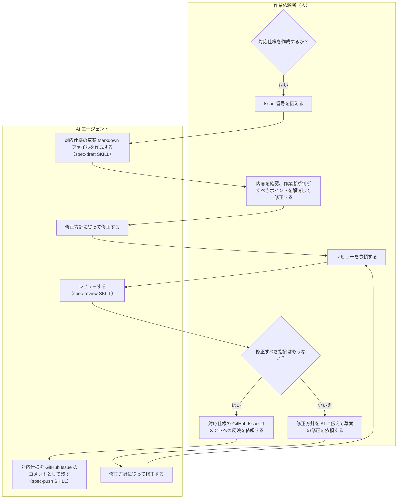
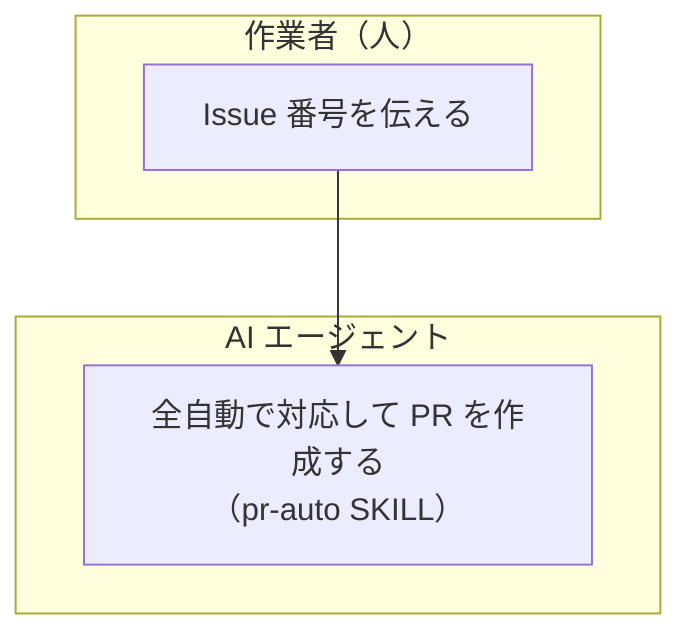
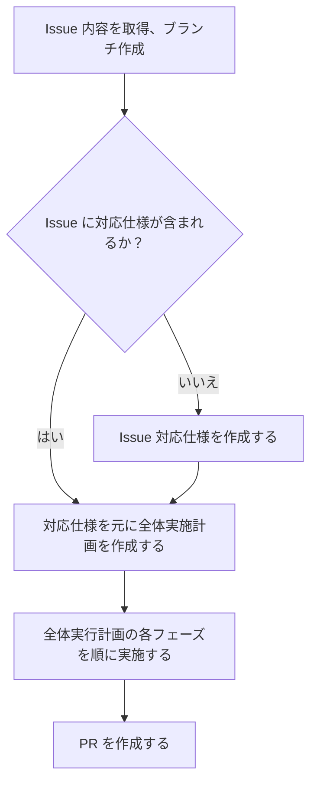
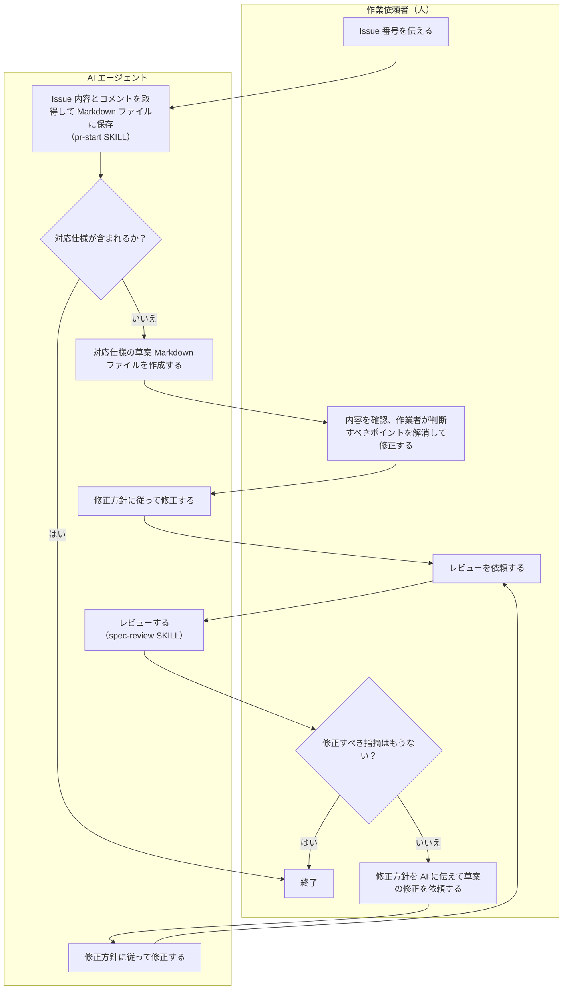
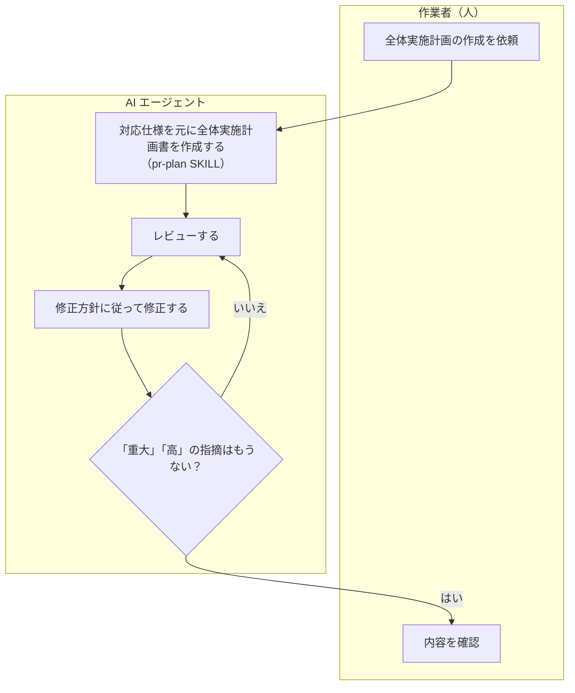

# ワークフロー

## 担当者の責務分担

担当者の責務は以下の３つに分けます。

1. 作業依頼者（人間） = 作業タスク Issue を作成する
1. 作業者（AI エージェント含む） = 作業タスクを実施して PR を作成する
1. 責任者（人間） = PR マージ判断を行う

## Issue の種類

Issue は以下の２つに分けます。

1. 作業タスクを作成するための Issue (Type: Task)
2. バグ報告などの問題や課題、提案を報告するための Issue (Type: Bug, Feature)

2 に対して対処する際には、作業依頼者が 1 の作業タスクとしての Issue を作成します。
作業者が対応するのは、1 の作業タスクとしての Issue です。

## 途中作成したドキュメントの扱い

基本的な考え方は「テストを含むソースコードが仕様」です。仕様書を更新しながらメンテナンスするということはしません。

このワークフローでは途中で以下のようなドキュメントを作成しますが、これらは作業が完了したら削除し、リポジトリには残しません。

- Issue に対してどう対応するかの仕様をまとめたドキュメント
- 仕様に基づいてどのように実装をするかの全体実施計画をまとめたドキュメント
- 複数フェーズに分かれる場合は、各フェーズの詳細実施計画をまとめたドキュメント

ワークフローを実施するために作成する上記のような途中生成物としてのドキュメントは、担当者が誰かによって Issue または PR のコメントとして残します。

- 作業依頼者が仕様を策定する場合は Issue のコメントに残す
- 作業者が仕様を策定する場合は PR のコメントに残す
- 作業者が作成する全体実施計画や各フェーズの詳細実施計画は PR のコメントに残す

このようにすることで、リポジトリにメンテナンスの必要なドキュメントとして残さず、作業依頼者または作業者の履歴としては情報を残すことができます。

## 作業依頼者のワークフロー

### Issue を作成する

1. 作業依頼者が AI エージェントに要望を伝え、AI エージェントが必要であれば複数 Issue に分割して草案 Markdown ファイルを作る
    - issue-draft SKILL を利用
1. 作業依頼者が必要に応じて草案を修正する
    - AI と相談したり、修正を AI に依頼してもよい
1. 作業依頼者が修正した内容で GitHub Issue を作成する。作成し終えた Issue の Markdown ファイルは削除される。
    - issue-push SKILL を利用

### Issue を元に対応仕様を作成する（オプション）

必要な場合のみ、以下の流れで対応仕様を作成します。AI エージェントが草案を作成・修正し、作業依頼者が確認した後に、AI エージェントがレビューして改善方針をまとめます。必要に応じてこの流れを繰り返します。作成しない場合は PR 作成時のワークフローへ進みます。

1. 作業依頼者が Issue 番号を伝え、AI エージェントに対応仕様の草案 Markdown ファイルを作成させる
    - spec-draft SKILL を利用
      - 内部でレビューを行い、人間の判断が必要ない修正は自動で行われる
      - 草案の最後には **作業依頼者が判断すべきポイント** を提示する
1. 作業依頼者が草案を確認して、必要に応じて修正する
    - **作業依頼者が判断すべきポイント** は全て解消しておく（AI と相談しつつ）
    - 修正方針を AI エージェントに指示して、修正させる
1. （別セッションに切り替え）
1. 何回かレビューと指摘修正を繰り返す
    1. spec-review SKILL を利用して、AI エージェントにレビューしてもらう
    1. 指摘事項に対しての修正方針を AI エージェントに指示して、修正させる
    1. （別セッションに切り替え）
1. 作業依頼者が確定した Issue 対応仕様を GitHub Issue のコメントとして残し、草案 Markdown ファイルは削除する
    - spec-push SKILL を呼び出す

## 作業者のワークフロー（全委任）

pr-auto SKILL を利用して、Issue 番号を指定して PR を作成します。

### AI エージェントの起動も自動化したい場合

以下のような仕組みで、自動で処理を開始するような仕組みを用意することも考えられます。

- GitHub Issue に何らかのトリガーを用意する
  - コメントに特定のキーワードを入れる
  - 特定のラベルを付与する
- 上記のトリガーを検知して AI エージェントに pr-auto SKILL を呼び出させる仕組みを用意
  - GitHub Actions で上記のトリガーを検知して、pr-auto SKILL を呼び出す
  - PC 上で常駐させたポーリングプログラムが上記のトリガーを検知して、AI エージェントに pr-auto SKILL を呼び出させる

## 作業者のワークフロー（協働）

作業者が AI エージェントと協働して対応する場合のワークフローは、pr-auto SKILL が全自動で行うのと同様の流れを、人が順に AI エージェントに指示を出しながら対応する形になります。

- 途中途中で人間がチェックを入れながら作業したい
- 理解負債を抱えないために、AI エージェントが行った内容を理解したい

などの場合に、このフローを選択します。

### Issue 対応仕様を用意、ブランチ作成

Issue に対応仕様が記載されていない場合は、作業者が対応仕様を作成します。

ただし **spec-push SKILL は実行しません**。
対応仕様は Issue ではなく PR のコメントに残します（最後に PR を作成する際に実行するスクリプトが処理します）。

### 対応仕様を元に全体実施計画を作成する

1. pr-plan SKILL を利用して、対応仕様を元に全体実施計画を作成
    1. レビューと修正の繰り返し
1. 内容を確認、必要に応じて変更を依頼

### 全体実行計画の各フェーズを順に実施する

全体実施計画の指定フェーズに対して以下を実行してください。
全体実施計画が１フェーズしかない場合は、全体実施計画をフェーズ１の詳細実施計画として扱ってください。

1. フェーズが複数ある場合はフェーズの詳細実施計画を立てる
    1. detail-plan SKILL を呼び出し、そのフェーズの詳細実施計画書を作成
    1. （別セッションに切り替え）
    1. レビューと修正の繰り返し
        1. detail-plan-review SKILL を呼び出し、出力されたフェーズ詳細実施計画のレビューを行う
        1. 各指摘事項や改善項目に対して修正方針を検討し、必要に応じて修正を指示
        1. （別セッションに切り替え）
1. 詳細実施計画書を指定して implement SKILL を呼び出し、フェーズの実施を行う
1. （別セッションに切り替え）
1. レビューと修正の繰り返し
    1. 詳細実施計画書を指定して implementation-review SKILL を呼び出し、計画通りに実施されたかどうか、問題がないかどうか、改善点がないかどうかをレビューする
    1. 各指摘事項や改善項目に対して修正方針を検討し、必要に応じて修正を指示
    1. （別セッションに切り替え）
1. refactor SKILL を呼び出し、リファクタリングを行う
1. （別セッションに切り替え）
1. git-commit SKILL を呼び出し、適切で簡潔なコミットメッセージで git コミットする
1. （別セッションに切り替え）

### PR を作成する

1. create-pr SKILL を呼び出し、PR を作成する。
    - PR のタイトルと説明は、対応仕様を元に自動で生成される。
    - 途中生成したドキュメント類は PR のコメントに残され、削除される

## 規約

- 途中生成ドキュメントは `./docs/tmp/` に置くこととし、.gitignore に追加しておく想定。
    - Issue 作成時の Markdown ファイルの置き場所は ./docs/tmp/issues/ 以下とする
    - Issue 対応時の Issue 内容の Markdown ファイルの置き場所は ./docs/tmp/issue.md とする
    - 仕様 Markdown ファイルの置き場所は ./docs/tmp/spec.md とする
    - 全体実装計画の草案 Markdown ファイルの置き場所は ./docs/tmp/impl-plan.md とする
    - フェーズごとの詳細実装計画の草案 Markdown ファイルの置き場所は ./docs/tmp/impl-plan-phase-◯.md とする
- ADR の置き場所は ./docs/decisions/ 以下とする
    - ADR のファイル名は `20260613-123-title.md` とする（20260613 は日本時間の日付、123 は Issue 番号、title は ADR のタイトル）
